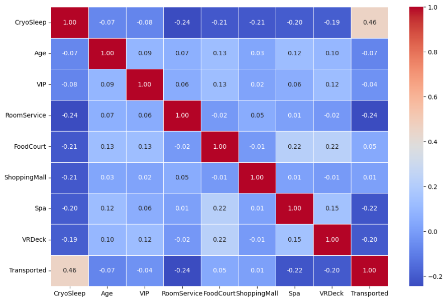
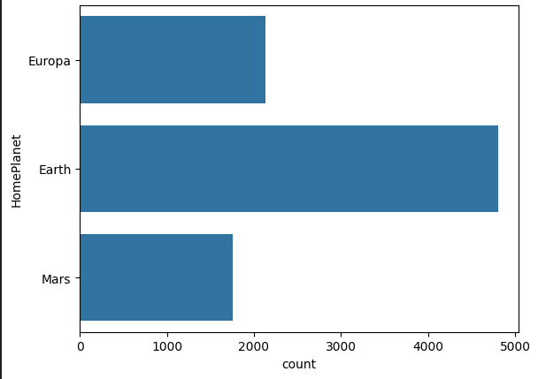
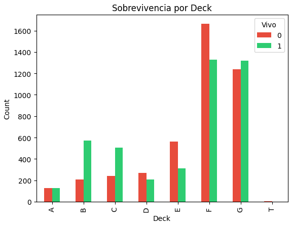
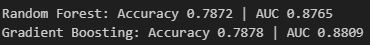
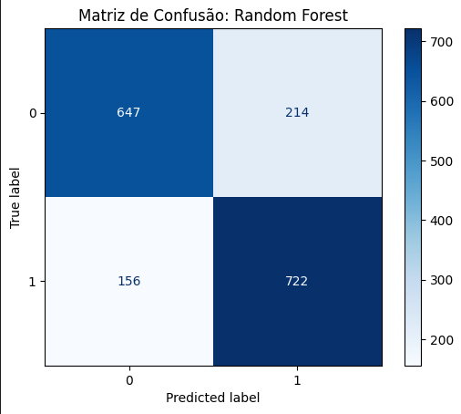
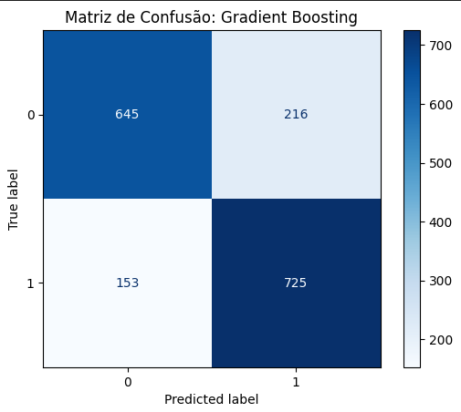
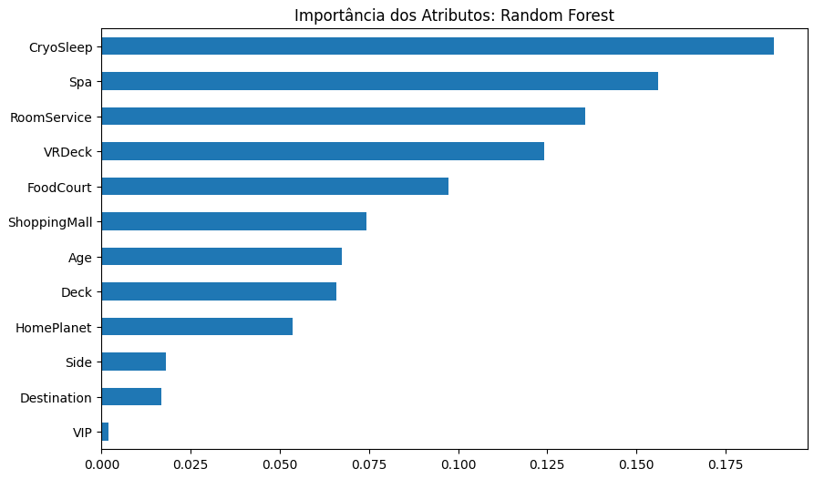
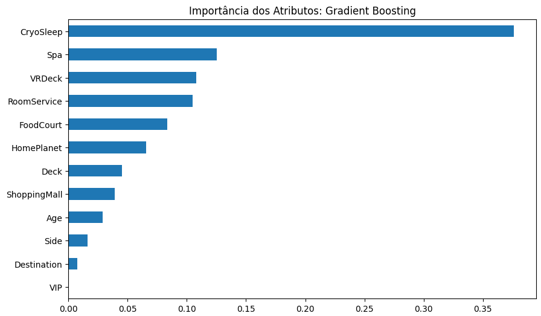

# 🚀 Spaceship Titanic — Kaggle Competition

> **Kaggle Competition** | Machine Learning | Binary Classification | Python

Machine Learning project developed for the [Spaceship Titanic](https://www.kaggle.com/competitions/spaceship-titanic) Kaggle competition. The goal is to predict which passengers were transported to an alternate dimension after the ship collided with a spacetime anomaly.

---

## 📋 Table of Contents

- [About the Problem](#-about-the-problem)
- [Project Structure](#-project-structure)
- [Technologies Used](#-technologies-used)
- [Project Pipeline](#-project-pipeline)
- [Exploratory Data Analysis (EDA)](#-exploratory-data-analysis-eda)
- [Models](#-models)
- [Results & Metrics](#-results--metrics)
- [Submission](#-submission)

---

## 🛸 About the Problem

The task is a **binary classification** problem: using passenger data (home planet, onboard spending, cabin, etc.), predict whether each passenger was **transported (True)** or **not (False)** to the alternate dimension.

**Target variable:** `Transported` (True/False → 1/0)

---

## 📁 Project Structure

```
Spaceship titanic/
│
├── 📓 spaceship-titanic-rfc-gradient-detailed-pt-br.ipynb  # Main notebook
├── 📄 train.csv                                             # Training data
├── 📄 test.csv                                              # Test data
├── 📄 submission.csv                                        # Generated submission file
├── 📄 sample_submission.csv                                 # Kaggle sample submission
├── 🎬 Spaceship Titanic RFC && Gradient_ Detailed PT-BR.mp4 # Walkthrough video
│
└── 📂 img/
    ├── heatmap.png                     # Correlation matrix heatmap
    ├── habitant_count.png              # Passenger count by home planet
    ├── sobrevivencia_deck.png          # Transportation rate by deck
    ├── metrics_models.png              # Model metrics comparison
    ├── cm_rf.png                       # Confusion matrix — Random Forest
    ├── cm_gradient.png                 # Confusion matrix — Gradient Boosting
    ├── feature_importance_rf.png       # Feature importance — Random Forest
    └── feature_importance_gradient.png # Feature importance — Gradient Boosting
```

---

## 🛠️ Technologies Used

| Library | Purpose |
|---|---|
| `pandas` | Data manipulation and analysis |
| `numpy` | Numerical operations |
| `seaborn` / `matplotlib` | Data visualization |
| `scikit-learn` | Preprocessing, models, and metrics |

---

## 🔄 Project Pipeline

The project follows a clear, well-structured Machine Learning pipeline:

```
Data Loading
      ↓
Feature Engineering (Cabin → Deck + Side)
      ↓
Exploratory Data Analysis (EDA)
      ↓
Missing Value Treatment
      ↓
Categorical Encoding
      ↓
Train/Validation Split
      ↓
Model Training (Random Forest + Gradient Boosting)
      ↓
Evaluation & Comparison (Accuracy + AUC)
      ↓
Submission File Generation
```

### 1. Data Loading

```python
df_train = pd.read_csv('train.csv')
df_test  = pd.read_csv('test.csv')
```

The training dataset contains **8,693 records and 14 columns**, while the test dataset has **4,277 records**.

---

### 2. Feature Engineering — `Cabin` Column

The `Cabin` column was stored in the format `deck/num/side`. It was split into three more informative columns:

```python
df_train[['Deck', 'Num', 'Side']] = df_train['Cabin'].str.split('/', expand=True)
df_train.drop(['Cabin', 'Num'], axis=1, inplace=True)
```

- **`Deck`**: letter identifying the cabin floor (A–G, T)
- **`Side`**: side of the ship (`P` = Port / `S` = Starboard)
- **`Num`** was dropped as it adds no predictive value

---

### 3. Missing Value Treatment

Strategy: **mode for categorical columns** and **mean for numerical columns**.

```python
# Categorical → Mode
cat_cols = df_train.select_dtypes(include=['object']).columns
df_train[cat_cols] = df_train[cat_cols].fillna(df_train[cat_cols].mode().iloc[0])

# Numerical → Mean
num_cols = df_train.select_dtypes(include=['float64']).columns
df_train[num_cols] = df_train[num_cols].fillna(df_train[num_cols].mean())
```

After this step, **zero null values** remain in both datasets.

---

### 4. Additional Transformations

- `Transported`, `VIP`, and `CryoSleep` were cast from `bool` to `int` (0/1)
- `Age` had its mode applied and was converted to `float`
- `Name` and `PassengerId` were dropped from training (no predictive contribution)

---

### 5. Categorical Encoding

```python
encoder = OrdinalEncoder()
df_train[obj_cols] = encoder.fit_transform(df_train[obj_cols])
df_test[obj_cols]  = encoder.transform(df_test[obj_cols])
```

`OrdinalEncoder` converts text variables into ordered integers:
- `HomePlanet`: Earth → 0, Europa → 1, Mars → 2
- `Destination`, `Deck`, `Side`: same logic

---

### 6. Train/Validation Split

```python
x_train, x_test, y_train, y_test = train_test_split(
    xtrain, ytrain, test_size=0.2, random_state=42
)
```

80% for training, 20% for validation, with `random_state=42` for reproducibility.

---

## 📊 Exploratory Data Analysis (EDA)

### Correlation Matrix

Heatmap showing correlations between all numerical variables in the dataset.



> Notable: `CryoSleep` has a strong **negative correlation** with onboard spending columns (RoomService, Spa, VRDeck, etc.) — which makes sense, as passengers in cryo-sleep cannot spend money. It also shows a **positive correlation** with `Transported`.

---

### Passenger Count by Home Planet

Distribution of passengers by `HomePlanet`.



> **Earth** has the most passengers on board, followed by Europa and Mars.

---

### Transportation Rate by Deck

Proportion of transported passengers per cabin deck.



> Decks **B and C** (predominantly Europa passengers) show higher transportation rates. Decks **F and G** hold more passengers overall, but with a different transport ratio.

---

## 🤖 Models

### Random Forest Classifier

```python
rf = RandomForestClassifier(
    n_estimators=200,
    max_depth=10,
    min_samples_split=5,
    random_state=42,
    n_jobs=-1
)
```

An ensemble of multiple decision trees using majority voting. Robust against overfitting and efficient with tabular data.

---

### Gradient Boosting Classifier

```python
gb = GradientBoostingClassifier(
    n_estimators=200,
    learning_rate=0.1,
    max_depth=3,
    random_state=42
)
```

A sequential ensemble where each new tree corrects the errors of the previous one. Generally more accurate than Random Forest, but slower to train.

---

## 📈 Results & Metrics

### Performance Comparison



| Model | Accuracy | AUC |
|---|---|---|
| Random Forest | ~0.79 | ~0.87 |
| Gradient Boosting | ~0.80 | ~0.88 |

> **Gradient Boosting** achieved slightly better performance on both metrics and was selected as the final model for submission.

---

### Confusion Matrices

**Random Forest**



**Gradient Boosting**



---

### Feature Importance

**Random Forest**



**Gradient Boosting**



> In both models, **`CryoSleep`** stands out as the most predictive feature, followed by spending on **`Spa`**, **`VRDeck`**, and **`RoomService`**. This suggests that a passenger's cryo-sleep status and spending profile are the strongest predictors of transportation.

---

## 📤 Submission

The best model is automatically selected based on accuracy:

```python
best_model = gb if gb_acc > rf_acc else rf

predictions = best_model.predict(df_test)

submission = pd.DataFrame({
    'PassengerId': id_passenger,
    'Transported': predictions.astype(bool)  # Ensures True/False format
})
submission.to_csv('submission.csv', index=False)
```

The `submission.csv` file is generated in the format required by Kaggle, with `PassengerId` and `Transported` (True/False) columns.

---
*Project developed as part of the Spaceship Titanic competition on Kaggle.*
